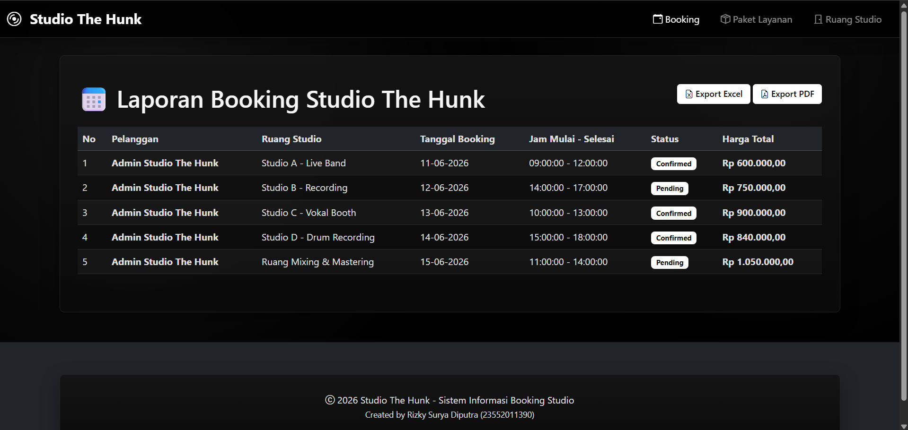
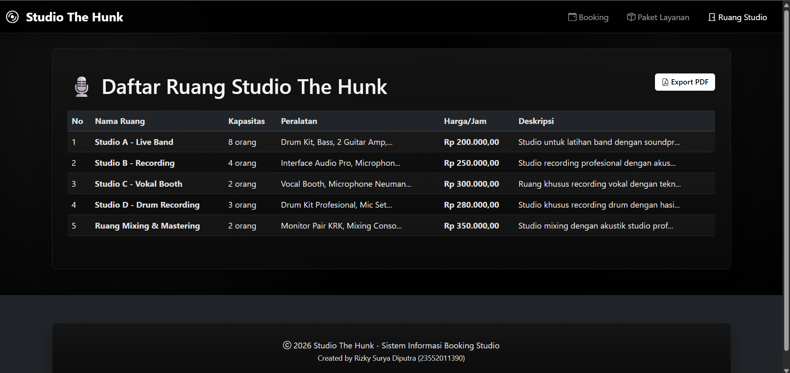
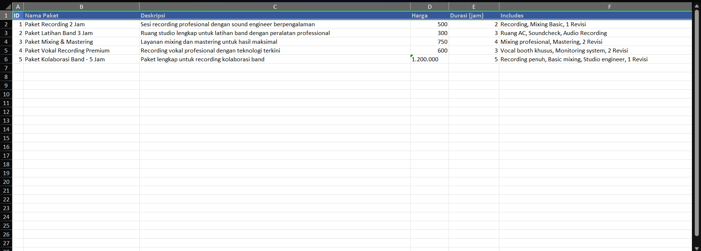
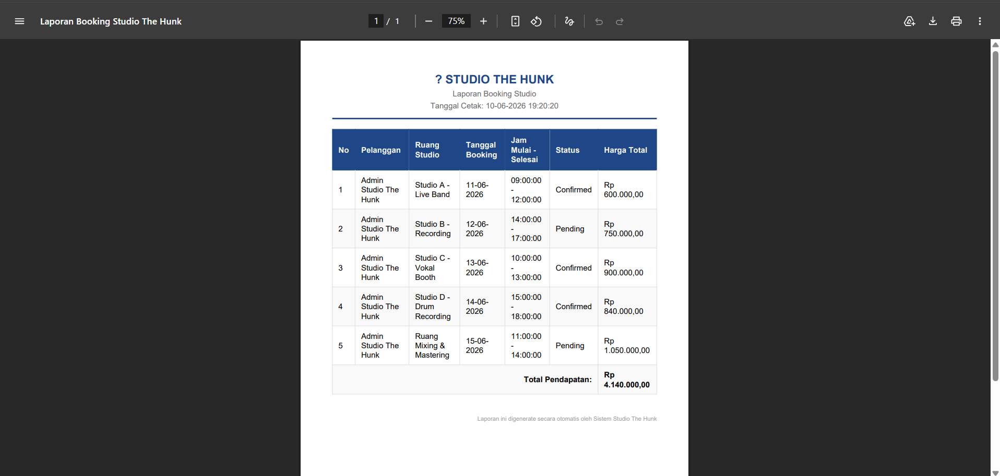

# Studio The Hunk

Sistem Informasi Studio Musik berbasis Laravel dengan fitur export Excel dan PDF untuk laporan booking studio, paket layanan, dan manajemen ruang studio.

## Berita Update

Update export excel dan pdf sudah diterapkan dan dipastikan tetap berjalan untuk laporan booking studio dan paket layanan. Pembaruan ini mencakup penyempurnaan hasil unduhan, penyesuaian tampilan tombol export, serta dokumentasi penggunaan yang lebih jelas di README.

## Informasi Proyek

- Nama proyek: Studio The Hunk
- Tema: Sistem Informasi Studio Musik
- Mata kuliah: Pemogramman Web 2
- Nama: Rizky Surya Diputra
- NIM: 23552011390

## Fitur Utama

### Fitur Export (NEW)
✨ **Export Excel dan PDF** untuk tiga laporan utama:

#### 1. **Laporan Booking Studio** 
   - Fitur: Lihat daftar booking, filter status (pending/confirmed), export dengan total pendapatan

#### 2. **Laporan Paket Layanan**
   - Fitur: Lihat semua paket layanan studio, harga, durasi, fasilitas yang termasuk

#### 3. **Daftar Ruang Studio**
   - Fitur: Lihat daftar ruang studio dengan kapasitas, peralatan, dan harga per jam

Fitur export Excel dan PDF:
✅ Export Booking ke Excel
✅ Export Booking ke PDF
✅ Export Paket Layanan ke Excel
✅ Export Paket Layanan ke PDF
✅ Export Ruang Studio ke PDF

## Screenshot

### halaman bookings

### paket layanan

### rooms

### excel

### pdf

