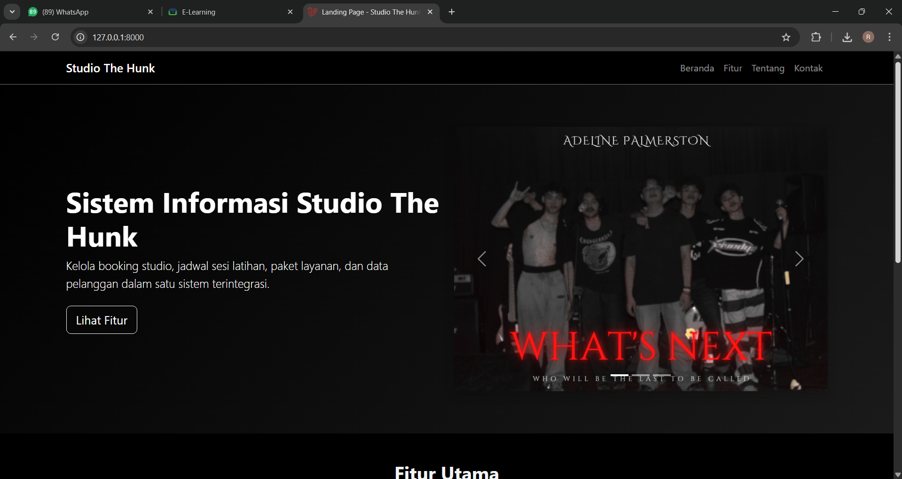
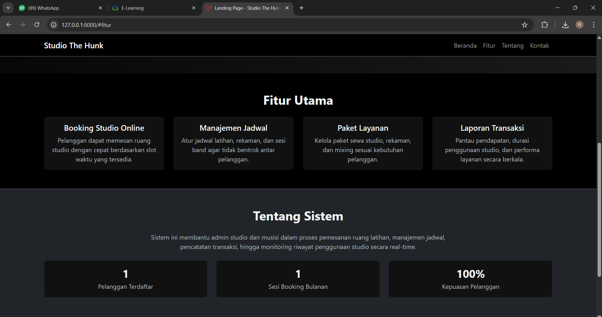
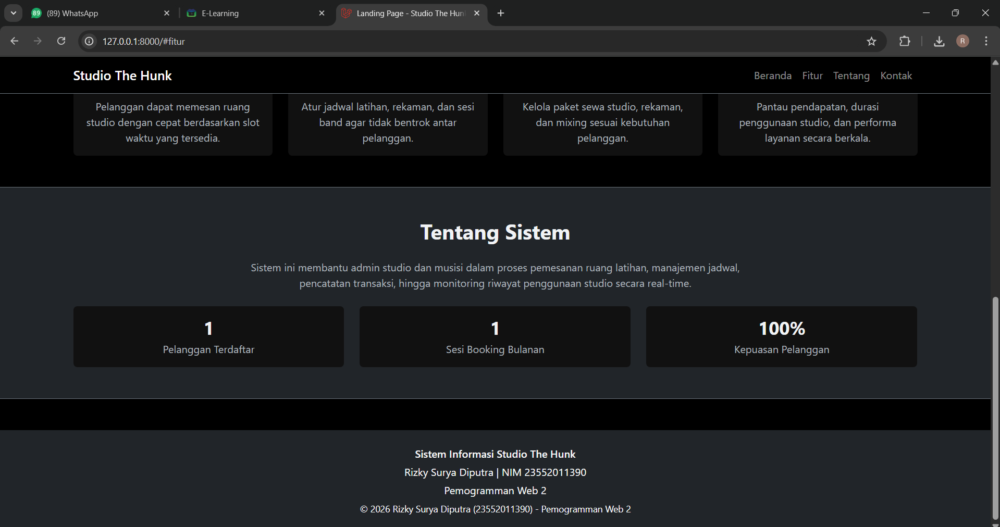

# Studio The Hunk

Landing page statis berbasis Laravel Blade untuk tema Sistem Informasi Studio Musik.

## Informasi Proyek

- Nama proyek: Studio The Hunk
- Tema: Sistem Informasi Studio Musik
- Mata kuliah: Pemogramman Web 2
- Nama: Rizky Surya Diputra
- NIM: 23552011390

## Fitur Utama

- Komponen Blade terpisah menggunakan `@include` untuk navbar dan footer
- Tampilan dengan Bootstrap
- Data dinamis dari route menggunakan variabel Blade `{{ }}`
- Carousel/banner Bootstrap pada hero section
- Tema warna dominan hitam

## Screenshot Tampilan

### Halaman Utama

### Section Fitur

### Section Tentang dan Footer

